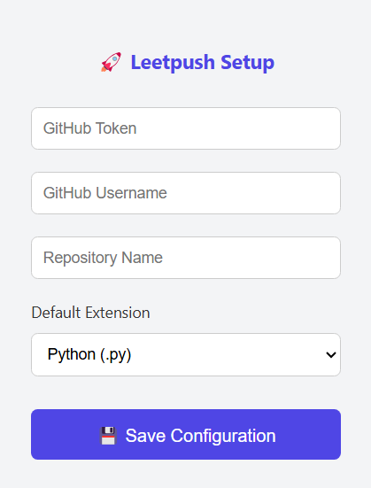
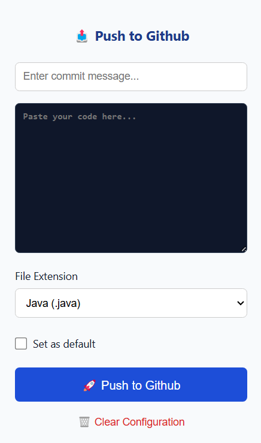

<p align="center">
  
</p>

<h1 align="center"> 🚀 Leetpush</h1>

---

## What is Leetpush?

**Leetpush** is a Chrome Extension that lets you **commit and push your LeetCode submissions** directly to your configured GitHub repository — without switching tabs.

---

## ✨ Features

- 🔒 **One-time GitHub setup** — Secure token-based GitHub integration

- ⚙️ **File type selector** with default file extension setting
- ♻️ **Clear Configuration** option to reset GitHub settings anytime
- 🚀 **One-click Push** with alert feedback

---

## 🔧 How to Use

### 1️⃣ Initial Setup

1. Install the extension in Chrome.
2. On first launch, fill in:
   - ✅ **GitHub Token**
   - 👤 **Username**
   - 📁 **Repository name**
   - 📄 **Default file extension** (.py, .java, .cpp)
3. Click **Save** to finish setup.

> Make sure your GitHub token has `repo` access.

---

### 2️⃣ Pushing LeetCode Code

1. Paste your LeetCode code into the stylish code box.
2. Enter a meaningful **commit message**.
3. Select the desired **file extension** (optional).
4. (Optional) Check **Set as default** to remember this file type.
5. Click **🚀 Push to GitHub**.
6. Wait for the loading spinner and confirm the alert.
7. ✅ That’s it — your code is now live on GitHub!

---

### 🧼 Reset Configuration

Need a fresh start?

- Click the **Clear Configuration** option in the popup.
- Confirm the dialog.
- The extension will close.
- When reopened, you'll see the **setup page again**.

---

## 📸 User Interface


| Setup Page | Push Page |
|------------|-----------|
|  |  |

---

## 🛠️ Developer Notes

All code styling is handled locally with modern CSS.  
You can also use CodeMirror for enhanced editor experience if needed.

---

## 📦 Clone This Repository

```bash 
git clone https://github.com/edwinjoel1202/Leet-Push.git
